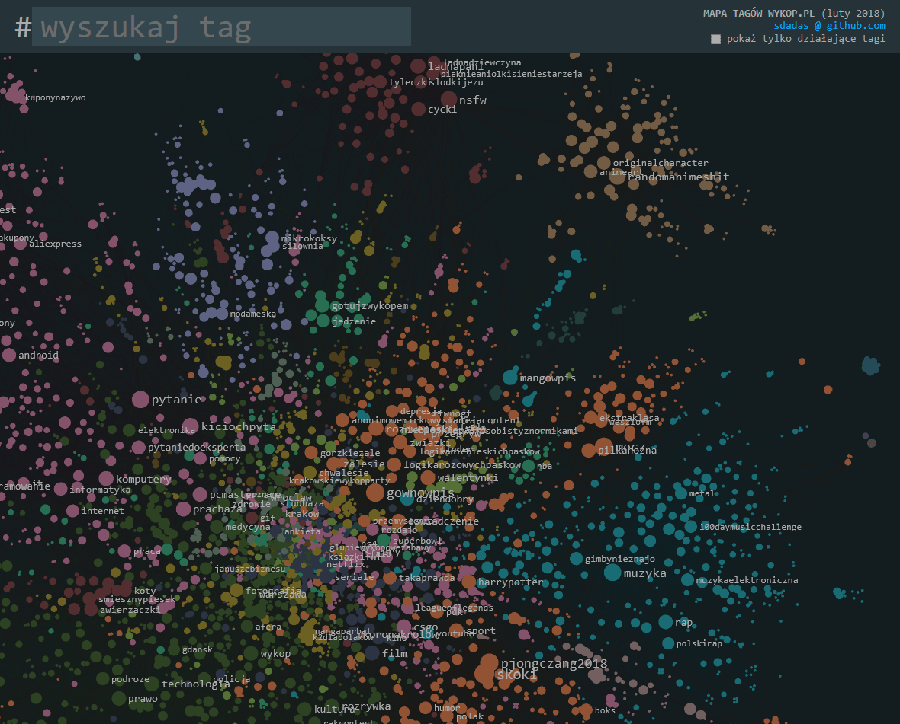

# Tag graph for wykop.pl

#### Showcase: [sdadas.github.io/taggraph](https://sdadas.github.io/taggraph)

This is a visualization of popular hashtags on [wykop.pl](https://wykop.pl). The repository includes a tool for crawling tags and their relations, and exporting the data to gexf format. Note that for the purpose of the visualization, the graph still needs to be edited manually - positioning and clustering was done using [Gephi](https://gephi.org/) graph visualization platform. `demo` directory contains simple web showcase created in typescript and [sigma.js](sigma.js).